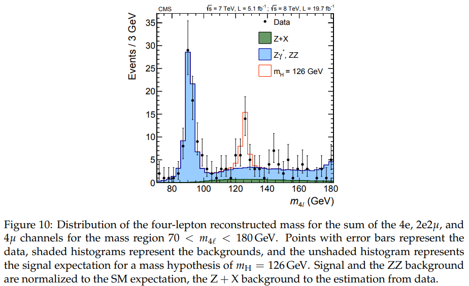
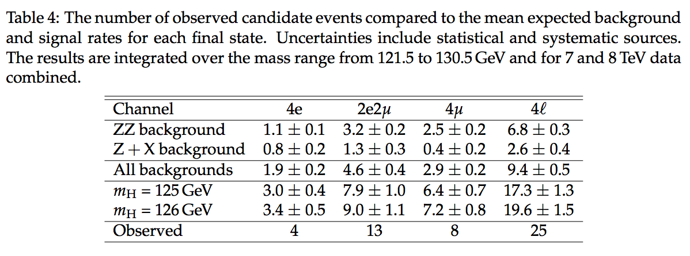

It is hardly possible today to avoid the use of statistical analysis. Consider the standard problem of measuring (or as statisticians say, estimating) the signal $s$ given the observation of a single count $N$ and given a background estimate $B\pm \delta B$. The obvious answer, which requires no fancy statistics, is $\hat s = N−B$ . But the estimate $\hat s$ is, of course, not enough. We need somehow to quantify its accuracy. It is generally accepted that a good way to do this is to compute an interval $[\underline{s}(N), \overline{s}(N)]$. But that too is not enough! We must also associate some measure (other than its width) to the interval. Why? So that we may compare intervals. Generally, one considers a shorter interval to be more accurate than a longer one, but it is only possible to make a meaningful statement when both are compared using the same value of the measure. The measure we use is **probability**. The probability can be interpreted as the fraction of intervals (not necessarily pertaining to the same measured quantity) that bracket the true (but generally unknown) value of that quantity; this is an example of the **frequentist** interpretation of probability, which in this context is called the **confidence level** (CL) associated with the **confidence intervals**. (Note: intervals plural; the CL is a property of the ensemble in which the interval is presumed to reside. Consequently, if one changes the parent ensemble then, in general, the CL will change.) Or, the probability can be interpreted as the degree of belief to be assigned to the statement $s \in [\underline{s}, \overline{s}]$; this is the **Bayesian** interpretation of probability, which in the present context is called a **credible** (or credibility) **level** (CL) associated with the given **credible interval**.

Given the ubiquity of statistical procedures in our field, tools have been created to help perform them correctly. In these exercises, you will learn how to use the statistical modeling toolkit `RooFit` and the associated statistical analysis toolkit `RooStats` to perform some standard, but very widely used, statistical procedures, including fitting, estimating (i.e., measuring) parameters, computing intervals, and setting limits. You will also learn how to use the tool `combine`, which, as its name suggests, can be used to perform statistical analyses of multiple results.

In order to focus on the essentials, and yet have realistic examples, exercises 1, 2, and 3 use the following data
{: width="75%"}
{: width="75%"} 

taken from the CMS $H \to ZZ \to 4\ell$ Run I summary paper ( [Measurement of the properties of the Higgs boson in the four-lepton final states, Phys. Rev. D 89 092007 (2014)](https://journals.aps.org/prd/pdf/10.1103/PhysRevD.89.092007)).


<!-- 

 -->